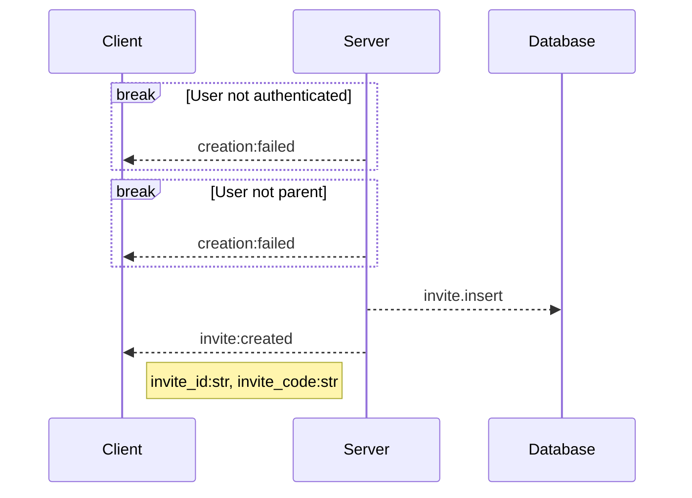
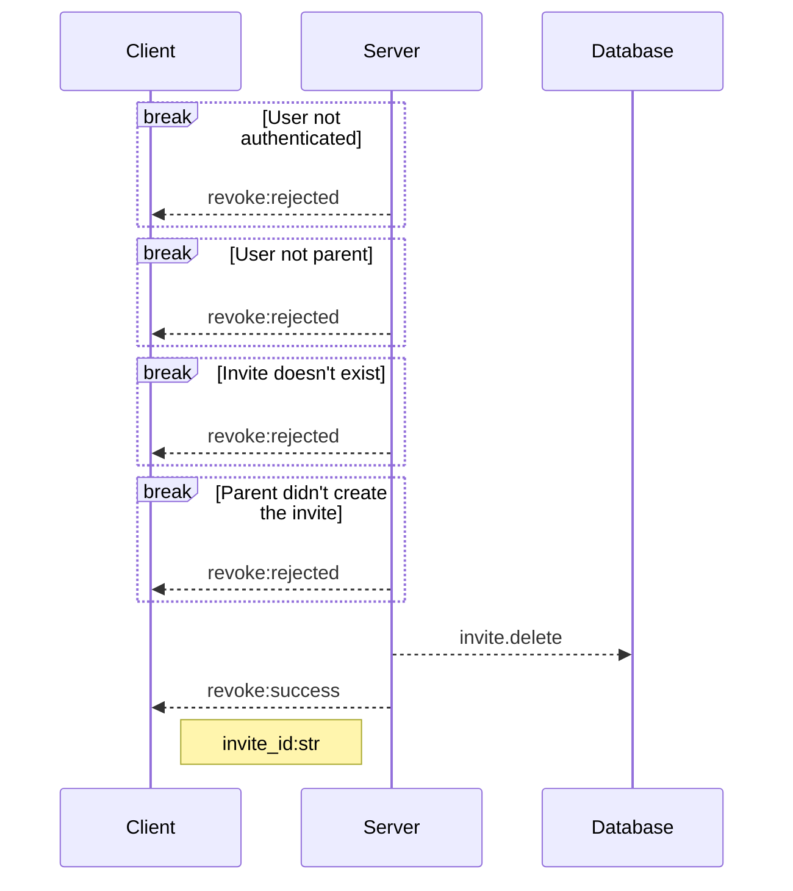
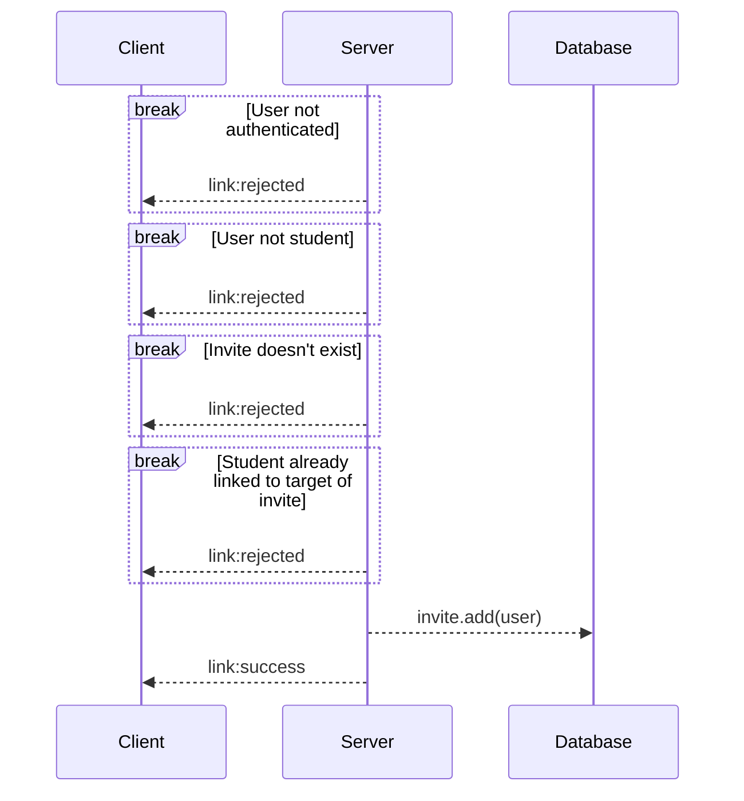
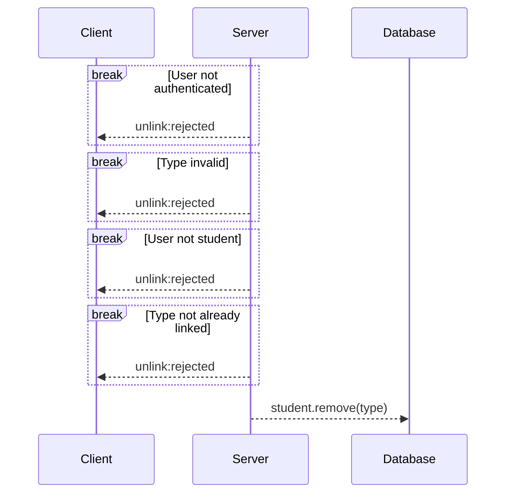
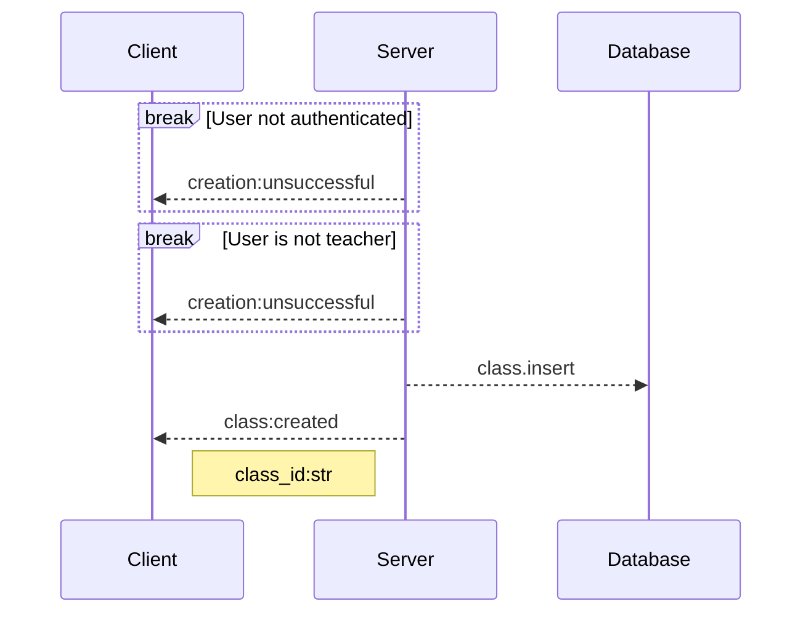
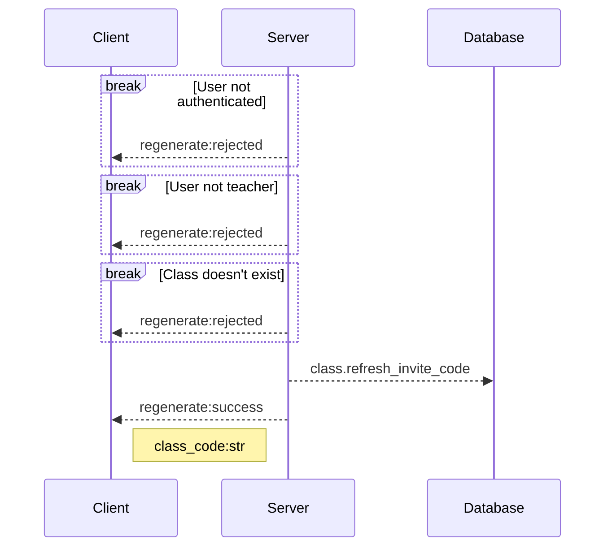

# `WS` /account/link

Linking student accounts to parents or classes, has to do with invite generation as well.

### Operations

---

#### parent:create_invite
Parent wants to create an invite

##### Required Data
|name|type|description|
|-|-|-|
|email?|string|Email of the student, if present, and student is already registered, send an email to the student|

##### Ok Response
|name|type|description|
|-|-|-|
|invite_id|string|Id of the newly created invite|
|invite_code|string|Code of the new invite, can be used to join the invite|

---

#### parent:revoke_invite
Parent wants to revoke an invite

##### Required Data
|name|type|description|
|-|-|-|
|invite_id|string|Identification of the invite|

##### Ok Response
|name|type|description|
|-|-|-|
|invite_id|string|Id of the deleted invite|

---

#### student:link
Operation used whenever a student wants to use an invite code to link to either a parent or a class

##### Required Data
|name|type|description|
|-|-|-|
|invite_code|string|Code of the invite, given by the parent|

##### Ok Response
No Data

---

#### student:unlink
Operation is used whenever a student wants to unlink from either a parent or a class

##### Required Data
|name|type|description|
|-|-|-|
|type|Literal["class", "parent"]|What the user wants to unlink from|

##### Ok Response
No Data

---

#### teacher:create_class
This operation is used whenever a teacher wants to create a class

##### Required Data
|name|type|description|
|-|-|-|
|name|string|Name of the class|

##### Ok Response
|name|type|description|
|-|-|-|
|class_id|string|New class ID|

---

#### teacher:regenerate_code
Operation is used whenever a teacher wants to refresh a classes code

##### Required Data
|name|type|description|
|-|-|-|
|class_id|string|Id of the class|

##### Ok Response
|name|type|description|
|-|-|-|
|class_code|string|New class code|

