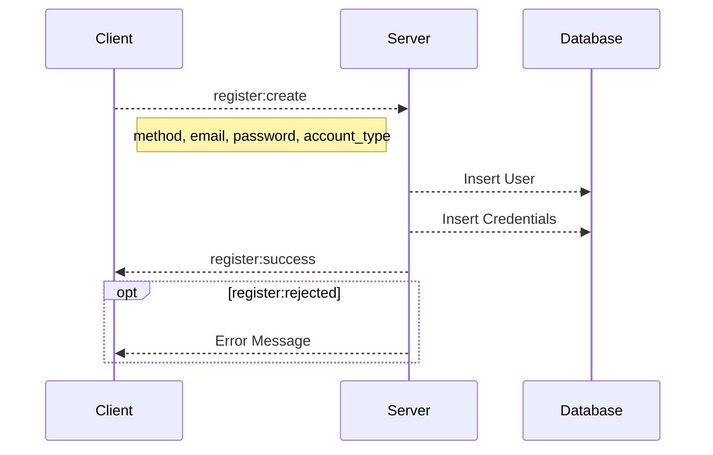

## `WS` /auth/register
Used to register accounts within the database

### Operations

---

#### register:create

Propose account creation

##### Required Data
|name|type|description|
|-|-|-|
|email|string|Email of the user, used for verification|
|name|string|Full name of the user|
|password|string|Password of the new account|
|account_type|Literal["student", "parent", "teacher"]|Type of account the user wants to create|

---

