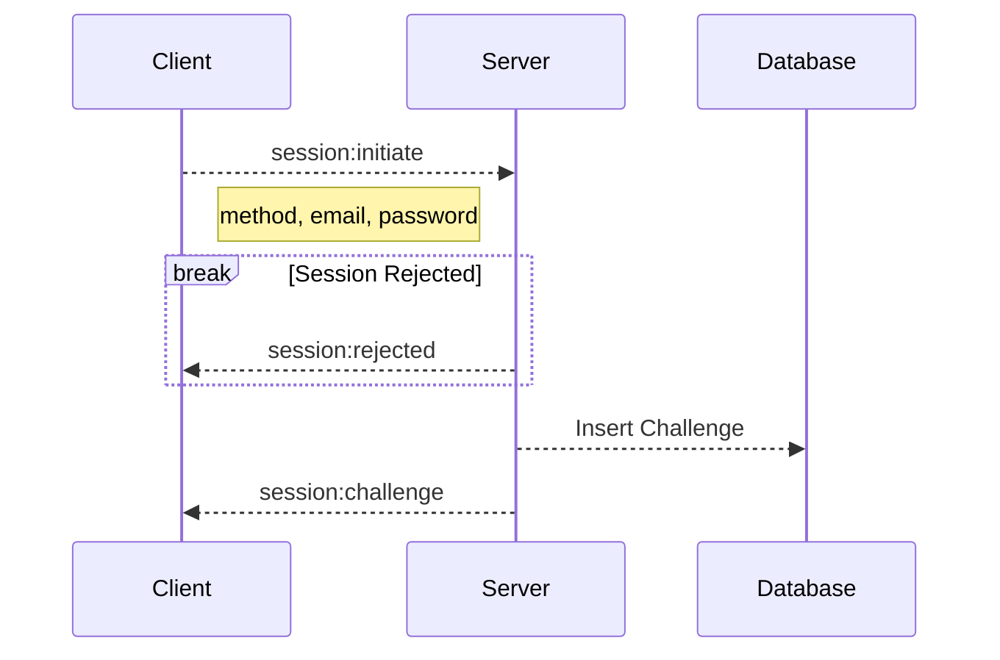
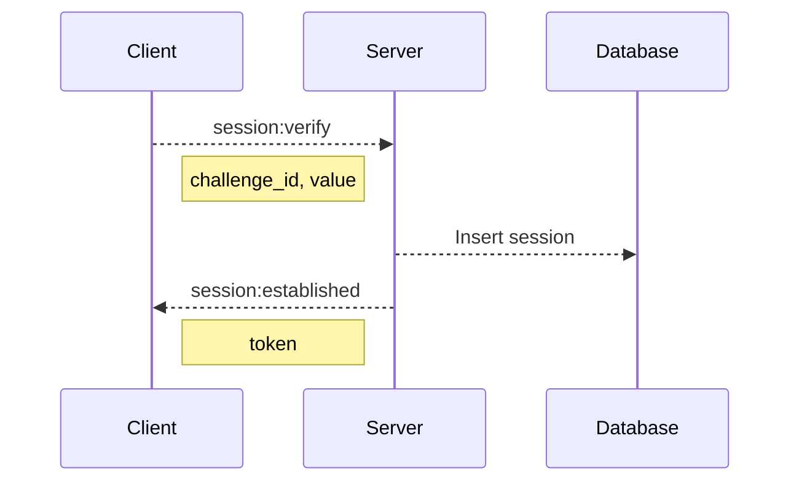

## `WS` /auth/session
Used to create sessions for accounts within the database

### Operations

---

#### session:initiate
Initiate a session

##### Required Data
|name|type|description|
|-|-|-|
|method|string|Method used to initiate the session|
|email|string|Email of the account|
|password|string|Password of the account|

---

#### session:verify:
Verify a session before its usable

##### Required Data
|name|type|description|
|-|-|-|
|challenge_id|Identification of the challenge|
|value|string|Value of the challenge, what's considered the key|

