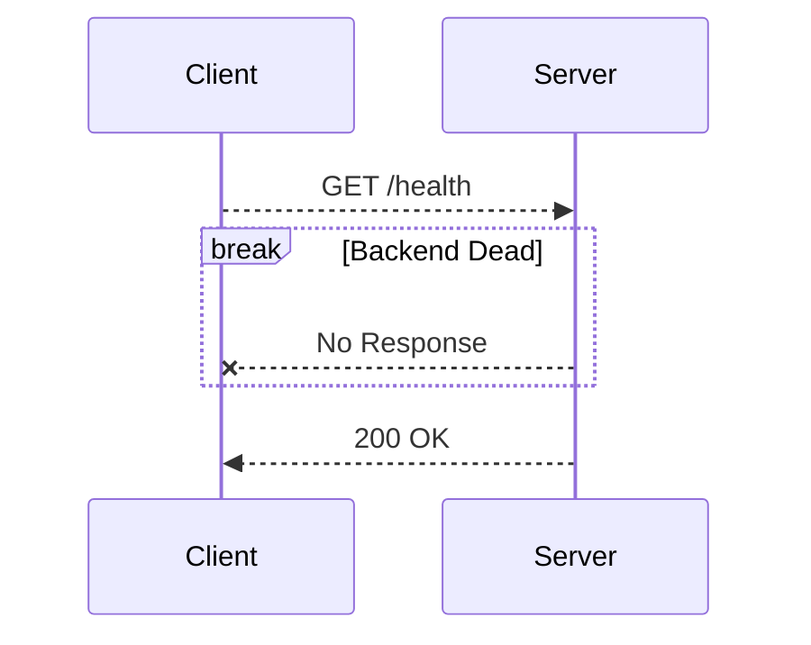

## `GET` /health
Returns a status code 200 (OK) if the backend is alive

```mermaid
sequenceDiagram
    participant Client
    participant Server

    Client -->> Server: GET /health

    break Backend Dead
        Server --x Client: No Response
    end

    Server -->> Client: 200 OK
```