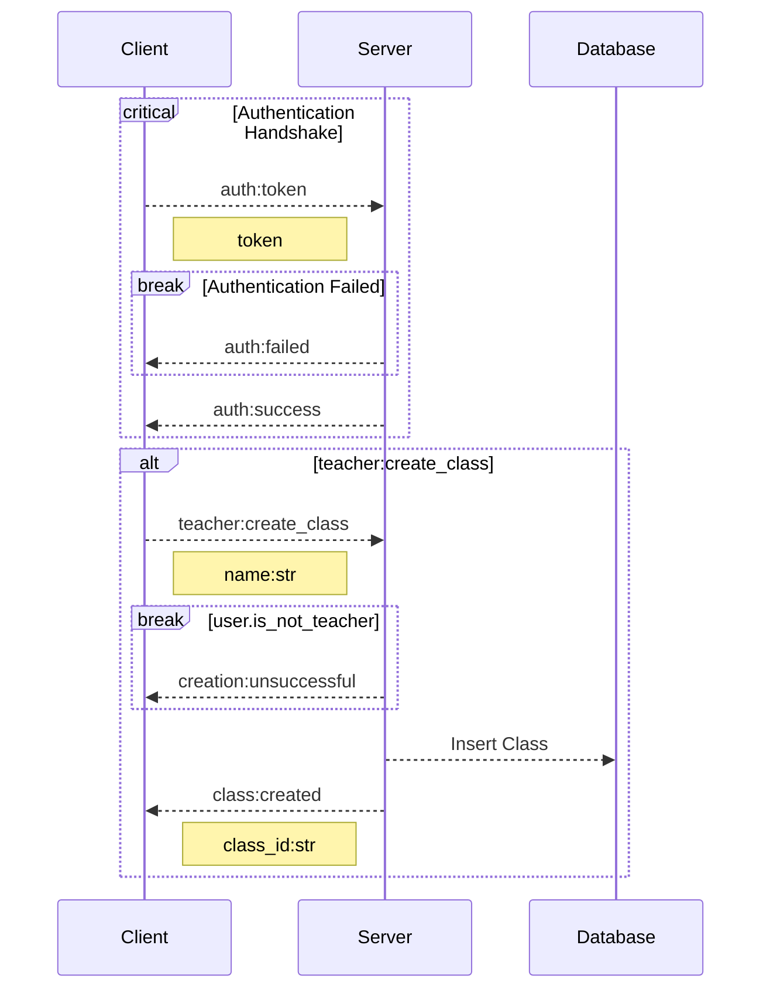

# /auth/link (ws)

Used to link accounts to other accounts or classes

```mermaid
sequenceDiagram
    participant Client
    participant Server
    participant Database

    critical Authentication Handshake
        Client -->> Server: auth:token
        Note right of Client: token

        break Authentication Failed
            Server -->> Client: auth:failed
        end 

        Server -->> Client: auth:success
    end

    alt teacher:create_class
        Client -->> Server: teacher:create_class
        Note right of Client: name:str

        break user.is_not_teacher
            Server -->> Client: creation:unsuccessful
        end 

        Server -->> Database: Insert Class

        Server -->> Client: class:created

        Note left of Server: class_id:str
    end
```