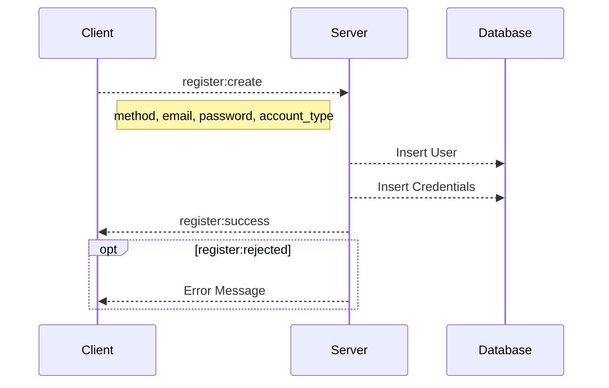

# /auth/register (ws)

Used to register accounts within the database

```mermaid
sequenceDiagram
    participant Client
    participant Server
    participant Database

    Client -->> Server: register:create
    Note right of Client: method, email, password, account_type

    Server -->> Database: Insert User
    Server -->> Database: Insert Credentials

    Server -->> Client: register:success

    opt register:rejected
        Server -->> Client: Error Message
    end
```