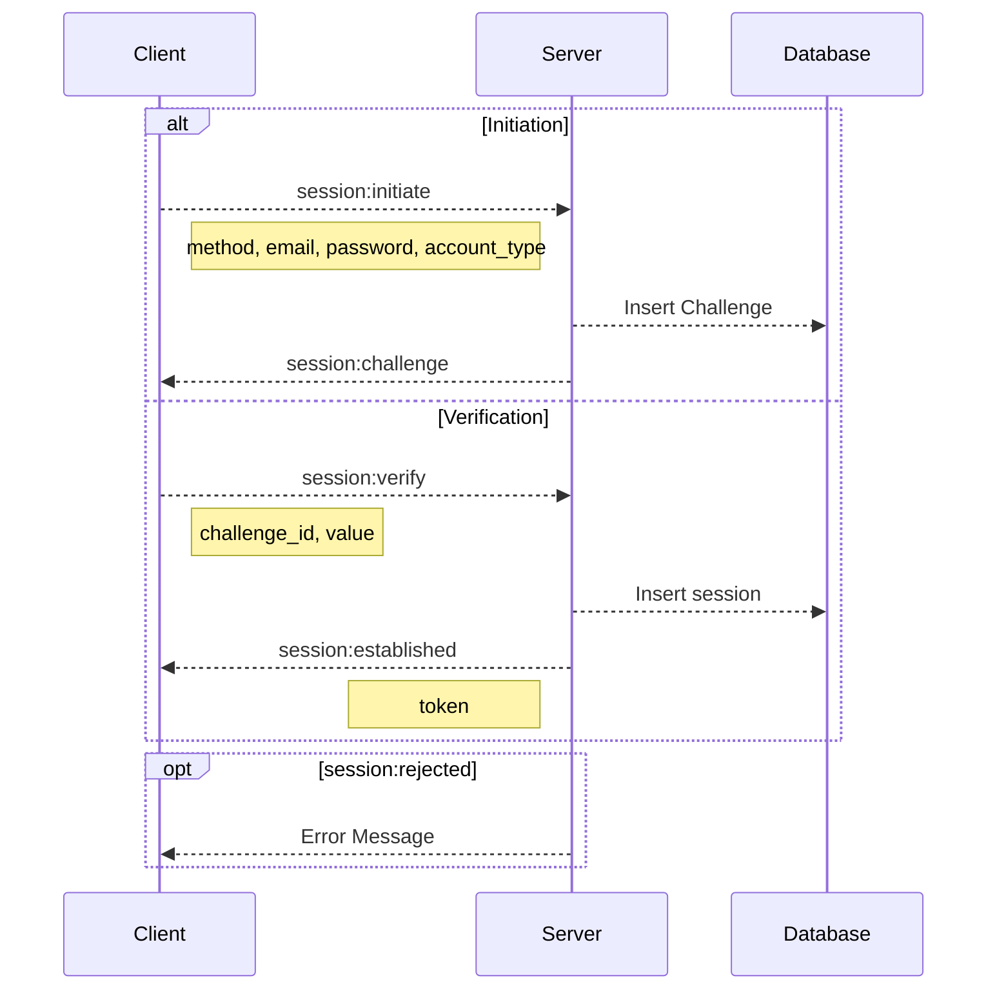

# /auth/session (ws)

Used to create sessions for accounts within the database

```mermaid
sequenceDiagram
    participant Client
    participant Server
    participant Database

    alt Initiation
        Client -->> Server: session:initiate
        Note right of Client: method, email, password, account_type

        Server -->> Database: Insert Challenge

        Server -->> Client: session:challenge

    else Verification
        Client -->> Server: session:verify
        Note right of Client: challenge_id, value

        Server -->> Database: Insert session

        Server -->> Client: session:established
        Note left of Server: token

    end

    opt session:rejected
        Server -->> Client: Error Message
    end
```
