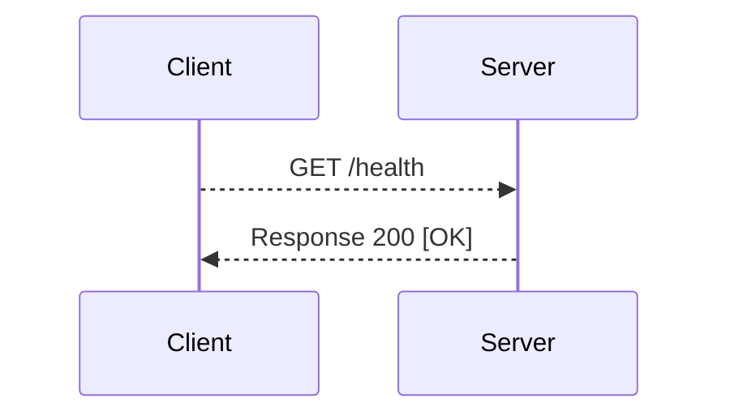

# /health (HTTP)

Route used to determine if the backend is alive

```mermaid
sequenceDiagram
    participant Client
    participant Server

    links Server: {"health.py": "https://github.com/Amaan-Dhanani/DriveHenrico/blob/main/packages/backend/api/health/health.py"}

    Client -->> Server: GET /health

    Server -->> Client: Response 200 [OK]
```